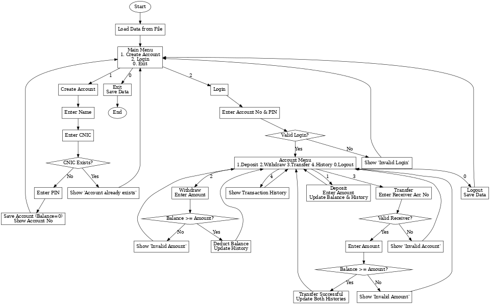
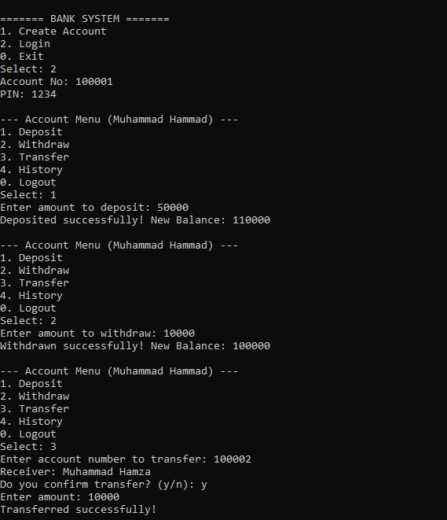
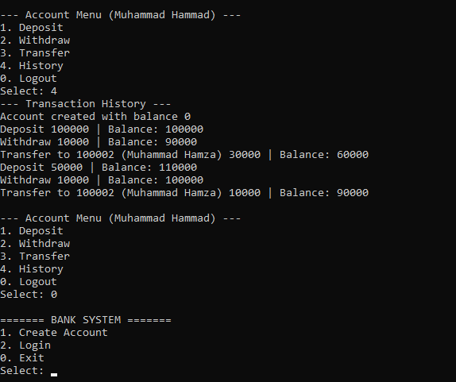
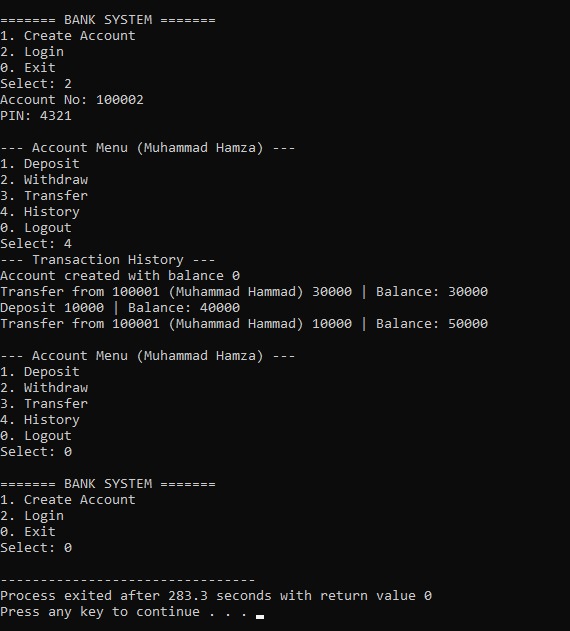

# 🏦 Bank Management System in C++ (File Handling)

This is a **Bank Management System Project in C++** using **File Handling**.  
It is a **beginner-friendly project**, perfect for **first semester students** who want to practice **C++ basics, file handling, and structured programming**.

---

## 🚀 Features
- 👤 **Create New Account**
- 💰 **Deposit Money**
- 💸 **Withdraw Money**
- 🔎 **Check Balance**
- 🔄 **Transfer Funds**
- 📝 **Update Account Information**
- ❌ **Delete Account**
- 📂 **Data Saved Automatically in File**

---

## 🛠 Technologies Used
- C++ (Core Language)  
- File Handling (`fstream`)  
- Structured Programming (no database, file-based storage)  

---

## 📊 Project Flowchart

---

## 🖼 Output Screenshots

### Create Account  

### Login Menu  

### History Acc 1:  

### History Acc 2:  

---

## 🎥 Demo Video
[▶ Watch Demo](assets/videos/demo.mp4)  

---

## ✨ Author
👨‍💻 Code written by **Hammad Solution**  
